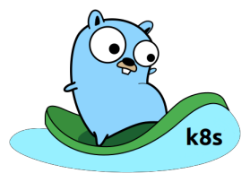

# kyaml2go <sub>(Pronounced as camel2go :camel:)</sub>
https://kyaml2go.prasadg.dev

Go client code generator from Kubernetes resource specs yaml



## Installation

### Install From Source

#### Step 1: Clone the repo
```bash
$ git clone https://github.com/PrasadG193/kyaml2go.git
```

#### Step 2: Build binary using make
```bash
$ make
```

#### Step 3: Convert K8s specs into Go client code

```bash
$ cat testdata/service.yaml
apiVersion: v1
kind: Service
metadata:
  name: mysql-service
  labels:
    app: mysql
spec:
  ports:
    - name: server
      port: 8080
      targetPort: 5000
      protocol: TCP
  type: ClusterIP
  selector:
    app: mysql

```

```bash
$ kyaml2go create -f testdata/service.yaml
// Auto-generated by kyaml2go - https://github.com/PrasadG193/kyaml2go
package main

import (
	"fmt"
	corev1 "k8s.io/api/core/v1"
	metav1 "k8s.io/apimachinery/pkg/apis/meta/v1"
	"k8s.io/apimachinery/pkg/util/intstr"
	"k8s.io/client-go/kubernetes"
	"k8s.io/client-go/tools/clientcmd"
	"k8s.io/client-go/util/homedir"
	"os"
	"path/filepath"
)

func main() {
	// Create client
	var kubeconfig string
	kubeconfig, ok := os.LookupEnv("KUBECONFIG")
	if !ok {
		kubeconfig = filepath.Join(homedir.HomeDir(), ".kube", "config")
	}

	config, err := clientcmd.BuildConfigFromFlags("", kubeconfig)
	if err != nil {
		panic(err)
	}
	clientset, err := kubernetes.NewForConfig(config)
	if err != nil {
		panic(err)
	}
	kubeclient := clientset.CoreV1().Services("default")

	// Create resource object
	object := &corev1.Service{
		TypeMeta: metav1.TypeMeta{
			Kind:       "Service",
			APIVersion: "v1",
		},
		ObjectMeta: metav1.ObjectMeta{
			Name: "mysql-service",
			Labels: map[string]string{
				"app": "mysql",
			},
		},
		Spec: corev1.ServiceSpec{
			Ports: []corev1.ServicePort{
				corev1.ServicePort{
					Name:     "server",
					Protocol: corev1.Protocol("TCP"),
					Port:     8080,
					TargetPort: intstr.IntOrString{
						Type:   intstr.Type(0),
						IntVal: 5000,
					},
					NodePort: 0,
				},
			},
			Selector: map[string]string{
				"app": "mysql",
			},
			Type:                corev1.ServiceType("ClusterIP"),
			HealthCheckNodePort: 0,
		},
	}

	// Manage resource
	_, err = kubeclient.Create(object)
	if err != nil {
		panic(err)
	}
	fmt.Println("Service Created successfully!")
}

```

## Usage

kyaml2go is available at https://kyaml2go.prasadg.dev

Alternatively, you can also use CLI to generate code

#### CLI

```bash
$ kyaml2go --help
NAME:
   kyaml2go - Generate go code to manage Kubernetes resources using go-client sdks

USAGE:
   kyaml2go [global options] command [command options] [arguments...]

VERSION:
   0.0.0

COMMANDS:
   create   Generate code for creating a resource
   update   Generate code for updating a resource
   get      Generate code to get a resource object
   delete   Generate code for deleting a resource
   help, h  Shows a list of commands or help for one command

GLOBAL OPTIONS:
   --help, -h     show help
   --version, -v  print the version

```

```bash
$ kyaml2go create/get/update/delete -f /path/to/resource_specs.yaml
```

## Workflow/Algorithm:
End-to-end workflow and algorithm to find imports can be found [here](https://docs.google.com/presentation/d/1_Es0d-QAkMMVdh8NiFCUMbKDQO76np-gCdTWlXLxAIY)

## Contributing

We love your input! We want to make contributing to this project as easy and transparent as possible, whether it's:
- Reporting a bug
- Discussing the current state of the code
- Submitting a fix
- Proposing new features

## Credits
The Go Gopher is originally by [Renee French](http://reneefrench.blogspot.com/)

This artwork is borrowed from an awesome artwork collection by [Egon Elbre](https://github.com/egonelbre/gophers)
